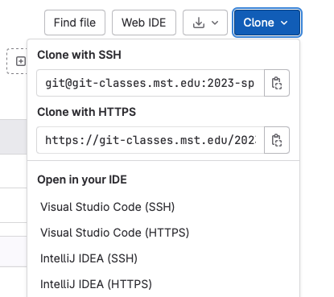

# CS1570-FS2023 Final Programming Project

https://docs.google.com/document/d/19MbqS0iB3cFGxSY24uunYBLKNT-yvXGxNqOtyIzVqGI/edit?usp=sharing

## Installation
1. __PuTTY__: Use the [PuTTY](https://it.mst.edu/services/remote-desktop-connection/install-putty/) program to remotely log into the Linux virutal machines in the Missouri S&T's Computer Science building.
    * The full list of virtual CS213 lab computers can be found [here](https://it.mst.edu/services/linux/hostnames/).
    * **For Linux and Mac Users**: If you are using a Linux or Mac computer, you can access the campus virtual Linux machines directly using the [`ssh`](https://www.ssh.com/academy/ssh/command) command in the terminal.
        * Open the terminal and enter the following command: `ssh <username>@<virtual machine hostname>`, where `<username>` is your Missouri S&T username and `<virtual machine hostname> ` is the hostname of the virtual machine you want to access.
    * If you live at a location not connected to Missouri S&T's campus WiFi network, before using PuTTY or ssh to gain access to the Linux virtual machines on campus, you will need to establish a [VPN](https://it.mst.edu/services/vpn/) (Virtual Private Network) connection first from your person comptuer.
2. Clone the repository for the new assignment that has been created for you to your local machine using the command `git clone <repository-url>` where `<repository-url>` should be replaced with the actual URL of the repository created for the student (shown in the following image). The URL can be either in HTTPS or SSH format, but in this class, we usually go for the HTTPS format.

## Usage
1. Once successfully cloned, navigate to the new project directory using the bash command `cd 2023-FS-<section>-HW#-<student_username>`. If you are unsure of the exact directory path, use the bash command `ls` to display the contents of the current working directory and locate the project directory.
2. Develop your C++ solution to the programming assignment and make sure that it successfully compiles without any unwanted warning messages.
3. **Note that your program must also compile successfully on the Missouri S&T's own campus Linux virtual machines in additon to any C++ compilers that you might be using on your personal computers. The graders will be grading your assignment using the G++ 9.4 C++ compiler installed there, which is the current stable release of the GNU GCC 9 series.**
4. Verify that your solution satisfies all of the specifications and requirements of the assignment's grading criteria.
5. Submit your work using the command `git add .` to add your C++ files to the change staging area.
6. Commit the changes to your repo using the command `git commit -m "<Brief descriptive message about the changes>`
7. Push your changes from the local repo to the remote repo using the command `git push`
8. And that's a wrap.   

## Development and Transfer of C++ Code
When developing C++ code for the assignment, some of you may prefer to use an IDE or other code editor on your personal computer rather than a command-line-based editor like nano. However, it is important to ensure that your code can compile and run on a Missouri S&T Linux virtual machine. To achieve this, we recommend that you test your code on the virtual machine before submission. To transfer your code from your personal computer to the virtual machine, you can use a network drive as described in the link provided (https://it.mst.edu/services/file-storage/network-drives/). By doing so, this will allow you to access and transfer network data (i.e. data and files stored at your Student drive (SDRIVE)) from home and personal computers.

Here are some popular IDEs and editors that can be used for C++ programming on Windows, Mac, and Linux:

For Windows:
* Visual Studio
* Visual Studio Code
* Code::Blocks
* Eclipse
* Dev-C++

For Mac:
* Xcode
* CodeLite
* Eclipse
* Clion

For Linux:
* Eclipse
* Code::Blocks
* CodeLite
* Geany

## Contact
If you have any questions or feedback, please contact Professor San Yeung at syeung@mst.edu.
